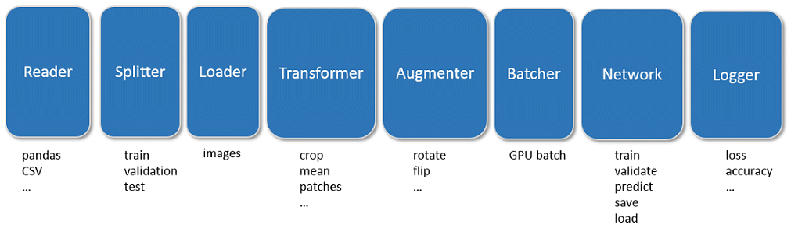

Introduction
============

Deep-learning code is characterized by

- data pre-processing on CPU and training on GPU
- mix of common and task-specific pre-processing steps
- training in epochs
- mini-batches of training data
- data transformation such as scaling, cropping and others
- data augmentation to increase amount of training data
- check-pointing of network weights
- logging of training progress

*nuts-ml* provides generic components, so called *nuts* that implement
these functions and can be arranged in task-specific data
processing pipelines. This leads to more readable and robust code that 
can be modified easily, which is in contrast to the monolithic,
unstructured code often found for data pre-processing.

Below an (incomplete) example of a typical pipeline for network training 
with **nuts-ml**. The ``>>`` operator defines the flow of data through the
pipeline

.. code:: Python

  t_loss = (train_samples >> PrintProgress(train_samples) >>
                             augment >> rerange >> Shuffle(100) >>
                             build_batch >> network.train() >> Mean())
  print("training loss  :", t_loss)

Canonical pipeline
------------------

A *canonical pipeline* for the processing of image data can be described 
by the following components

- *Reader*: sample data stored in CSV files, `Pandas <http://pandas.pydata.org/>`_ 
  tables, databases or other data sources is read,

- *Splitter*: samples are split into training, validation and sets, and stratified
  if necessary,

- *Loader*: image data is loaded for each sample when needed,

- *Transformer*: images are transformed, e.g. cropped or resized,

- *Augmenter*: images are augmented to increase data size by random rotations,
  flipping, changes to contrast, or others,

- *Batcher*: the transformed and augmented images are organized in mini-batches 
  for GPU processing,

- *Network*: a neural network is trained and evaluated on the GPU,

- *Logger*: the network performance (loss, accuracy, ...) is logged or plotted.

Depending on the specific application, the mode (training, testing, evaluation, ...) 
or data type (image, video, text) some of the processing steps will differ, others
will remain the same, but in general many components (nuts) can be shared.

Library
-------

**nuts-ml** is a library that provides common data-processing and machine learning 
components as *nuts*. It is based on `nuts-flow <https://maet3608.github.io/nuts-flow/>`_, 
which itself is largely based on Python iterators and the 
`itertools <https://docs.python.org/2/library/itertools.html>`_ library.

.. image:: pics/architecture.png
   :align: center

**nuts-flow** wraps iterators and itertool functions into *nuts* that provide a 
``>>`` operator, which enables the composition of iterators in pipelines. 
For instance, a nested itertool expression such as the following

.. code:: Python

  >>> list(islice(ifilter(lambda x: x > 5, range(10)), 3))  
  [6, 7, 8]

can be flattened and more clearly written with **nuts-flow** as

.. code:: Python

  >>> Range(10) >> Filter(_ > 5) >> Take(3) >> Collect()  
  [6, 7, 8]

**nuts-ml** extends **nuts-flow** with nuts specifically designed for machine learning 
and (image) data processing. The following code example shows a **nuts-ml** pipeline
with image transformation, image augmentation, batching, network training,
evaluation and check-pointing.

Example
-------

.. code:: Python

  rerange = TransformImage(0).by('rerange', 0, 255, 0, 1, 'float32')
  build_batch = (BuildBatch(BATCH_SIZE)
                 .input(0, 'image', 'float32')
                 .output(1, 'one_hot', 'uint8', NUM_CLASSES))
  p = 0.1
  augment = (AugmentImage(0)
             .by('identical', 1.0)
             .by('brightness', p, [0.7, 1.3])
             .by('color', p, [0.7, 1.3])
             .by('shear', p, [0, 0.1])
             .by('fliplr', p)
             .by('rotate', p, [-10, 10]))

  network = create_network()
  train_samples, test_samples = load_samples()

  for epoch in range(NUM_EPOCHS):
      t_loss, t_acc = (train_samples >> 
                       PrintProgress(train_samples) >>
                       augment >> 
                       rerange >> 
                       Shuffle(100) >>
                       build_batch >> 
                       network.train() >> 
                       Unzip())
      print("train loss :", t_loss >> Mean())
      print("train acc  :", 100 * (t_acc >> Mean()))

  e_acc = test_samples >> rerange >> build_batch >> network.evaluate([categorical_accuracy])
  print("test acc   :", 100 * e_acc)

The complete code and more examples can be found under
`nutsml/examples <https://github.com/maet3608/nuts-ml/blob/master/nutsml/examples>`_ .
See the :ref:`tutorial <cifar-example>` for a detailed explanation of the code.
